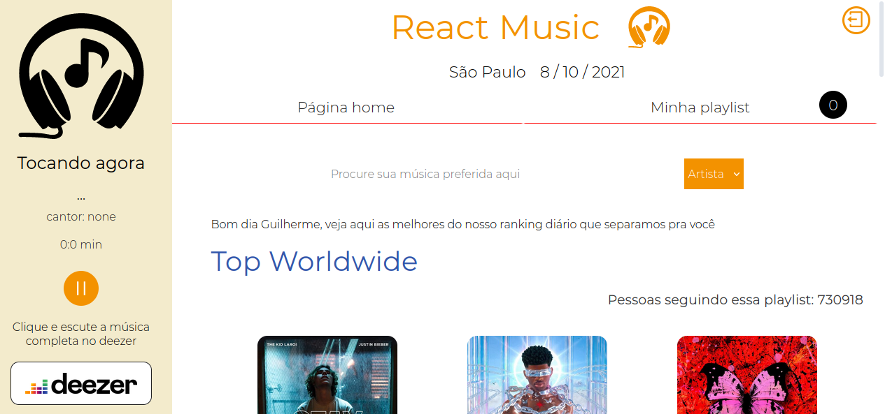

<center>
<h1>React Music</h1>
<h2>Um webApp criado para simular um aplicativo de músicas</h2>
</center>

<p>Bibliotecas utilizadas:</p>
<li><a href="https://reactrouter.com/web/guides/quick-start" target="_blank">React router dom</a></li>
<li><a href="https://styled-components.com/" target="_blank">Styled Compoenents</a></li>
<li><a href="https://react-icons.github.io/react-icons/" target="_blank">React Icons</a></li>
<li><a href="https://react-redux.js.org/" target="_blank">React Redux</a></li>
<li><a href="https://redux.js.org/" target="_blank">Redux</a></li>

<h3>Sobre o projeto 
🚀</h3>

<p>O projeto tem como foco principal trabalhar a manipulação dos dados vindos da <a href="https://developers.deezer.com/api" taget="_blank">API do deezer</a>, juntamente com o processo de gerenciamento de dados e troca de informações entre os componentes utilizando a biblioteca redux.<br></p>

<center>


</center>
<center><h2>Como acessar o projeto?</h2></center>

<p>Há duas formas, rodando na sua máquina local, ou acessando o link que leva ao site da netlify.<br></p>

<h3>Rodando na sua máquina local</h3>

<p>Como requisitos, é necessário que você tenha instalado o nodeJS em sua máquina, juntamente com o instalador de pacotes npm</p>

<li><a href="https://nodejs.org/en/" target="_blank">nodeJS</a></li>
<li><a href="https://www.devmedia.com.br/como-instalar-o-node-js-npm-e-o-react-no-windows/40329" target="_blank">Como instalar o nodeJS e npm?</a></li>

<p><br>Agora com tudo preparado, basta seguir os seguintes comandos:</p>
<p>Baixará os pacotes utilizados no projeto</p>

```
npm install
```

<p>Comando para rodar localmente</p>

```
npm start
```

<h3>Acessando o site</h3>

<p>Caso você não queira baixar esses pacotes, você pode usar a aplicação acessando o netlify, <a href="https://react-musicjs.netlify.app/" target="_blank">clique aqui</a></p>
