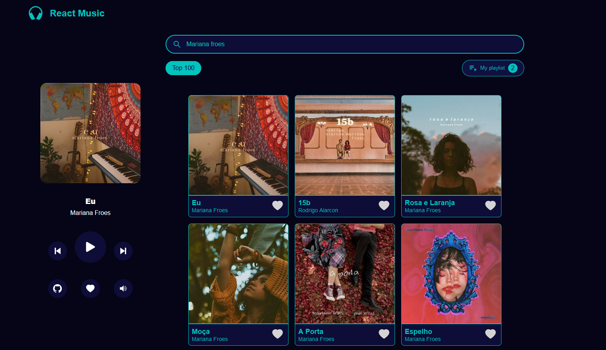
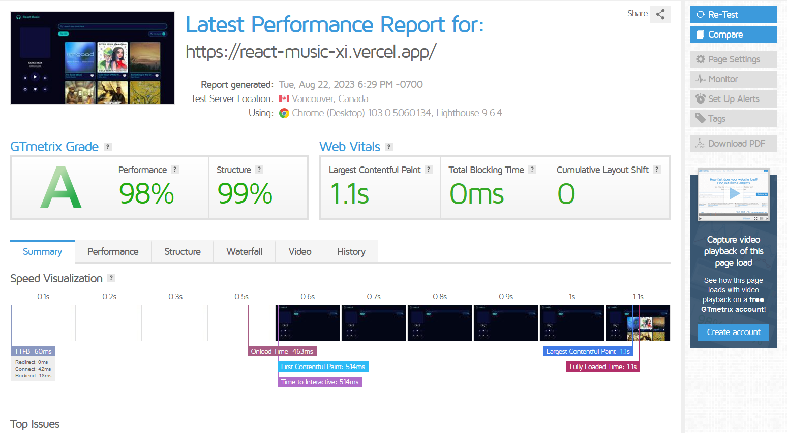

    <h1 align='center'>React music</h1>
     

  
This project was created with React, typescript, styled-components and Deezer API

 

  
If you want to see the website, 
    <a href='https://react-music-xi.vercel.app/' target='_blank'>click here</a>
  

 

## Steps to updated oldest project (more than 2 years)

### Goals

- [x] Fix route migration v5 => v6
- [x] Update all packages managers correctly
- [x] Add typescript
- [x] Create a simple design System UI in styled-components
- [x] Add a playground test to refactor all components
- [x] Insert react testing library and setup jest with typescript environment
- [x] Add storybook
- [x] Migrate state logic from react-redux to zustand
- [x] Create Interfaces to type all data objects in site
- [x] Add new UI features

 

- Fix migration react router dom:

1. Add all packages @latest version
2. Change react routers from v5 to v6
3. Remove useHistory to use useNavigate

- Update all packages correctly

1. npm i -g npm-check-updates
2. run the following command: ncu
3. ncu -u change all packages to latest version

- Add typescript

1. Fix all default problems issues temporally changing the tsconfig.json file, noImplictyAny: false
